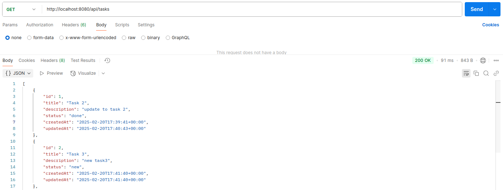
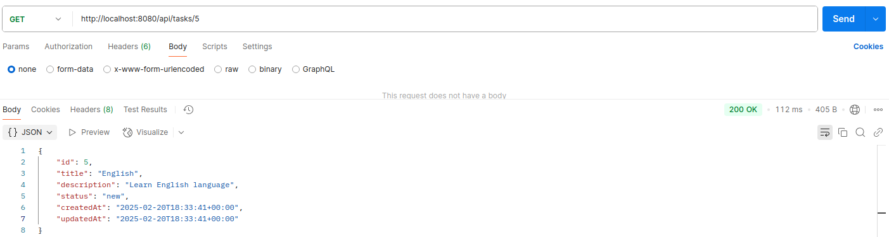
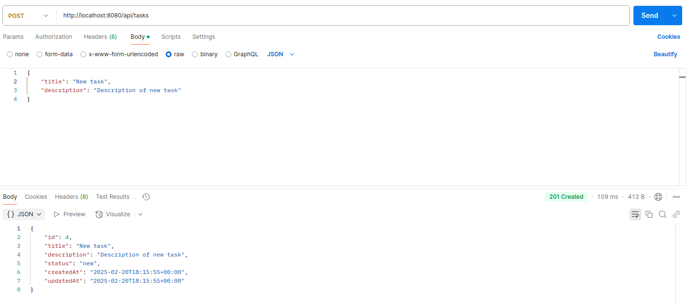
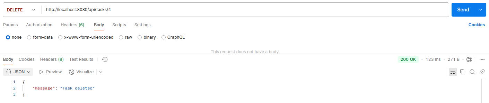

# REST API для управления списком задач (TODO list).

## Установка и настройка
Склонируйте репозиторий
```shell
git clone https://github.com/Zem-Alex/TODOlist.git
```

Перейдите в директорию проекта:
```shell
cd TODOlist
```

Чтобы создать и запустить контейнеры в docker введите следующую команду:
```shell
docker compose up -d
```

Создайте миграцию для создания таблицы tasks в базе данных:
```shell
sudo docker exec -it php php bin/console doctrine:migrations:diff

docker exec -it php php bin/console doctrine:migrations:migrate
```

## Использование
### REST API
После того как контейнеры запущены, вы можете получить доступ к бэкенду через http://localhost:8080.
API будет доступно по этому URL, для работы с задачами /api/tasks

- GET /api/tasks — получение списка всех задач.



- GET /api/tasks/{id} — получение задачи по ID.



- POST /api/tasks — создание новой задачи.

В body POST запроса необходимо прописать название и описание задачи:

```json
{
    "title": "New task",
    "description": "Description of new task"
}
```


- PUT /api/tasks/{id} — обновление задачи по ID.

В body PUT запроса необходимо прописать новое название, описание и статус задачи:

```json
{
    "title": "Updated task",
    "description": "Changed description of new task",
    "status": "in_progress"
}
```


- DELETE /api/tasks/{id} — удаление задачи по ID.




## Удаление контейнеров
Чтобы остановить и удалить контейнеры в docker введите следующую команду:
```shell
docker compose down
```
	 

